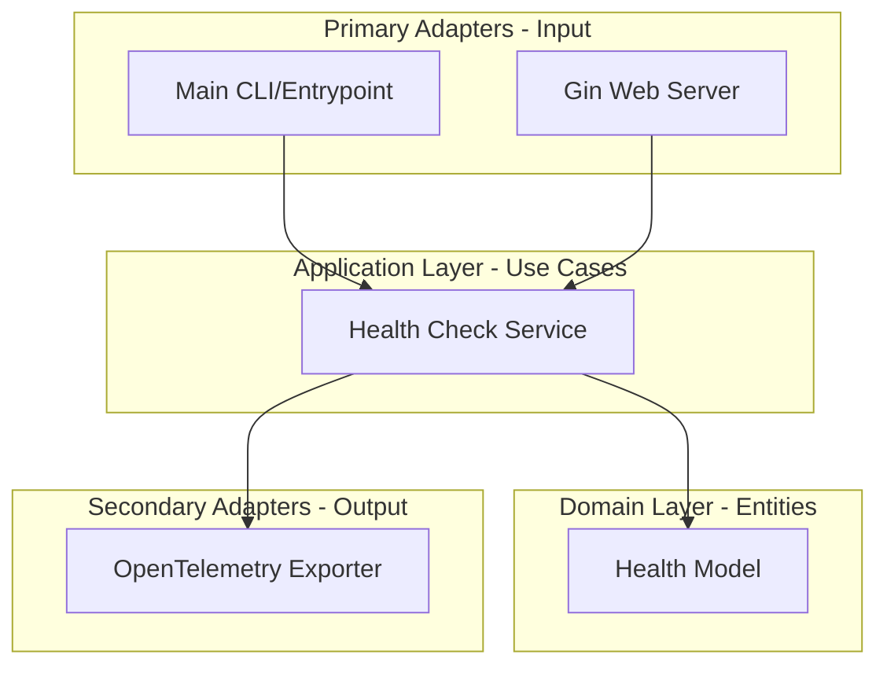
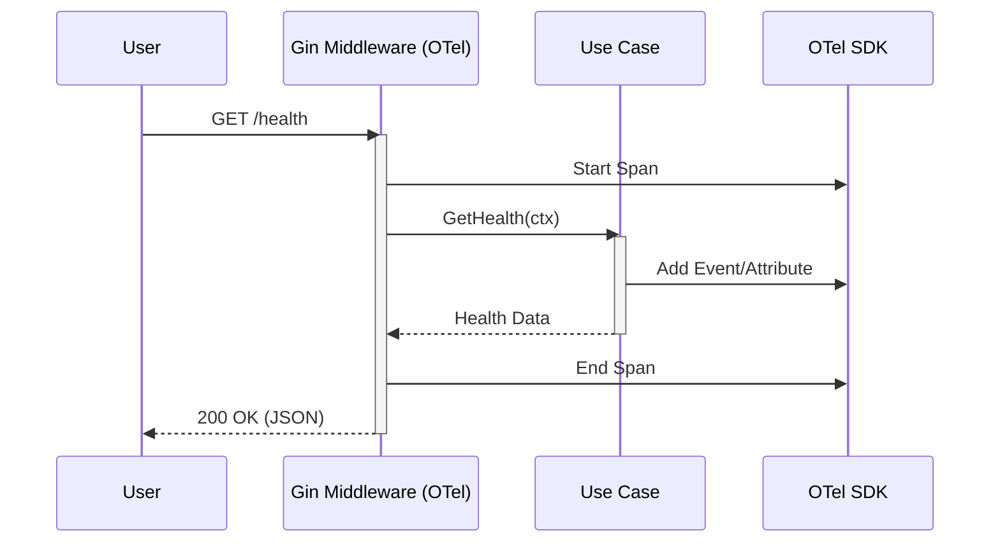

# Project Architecture

This document describes the architectural patterns and components used in the `go-boilerplate` project.

## Hexagonal Architecture (Ports and Adapters)

The project follows the Hexagonal Architecture pattern to decouple the business logic from infrastructure and external services.

## Data Flow & Observability

## Package Structure

- `cmd/api/`: Entry point of the application.
- `internal/application/`: Business logic and port interfaces.
- `internal/domain/`: Enterprise models and entities.
- `internal/infrastructure/`: Concrete implementations (Adapters).
    - `web/`: Gin server and handlers.
    - `telemetry/`: OpenTelemetry setup.
    - `config/`: Configuration management.
- `pkg/`: Shared libraries that are safe to use by other projects.
